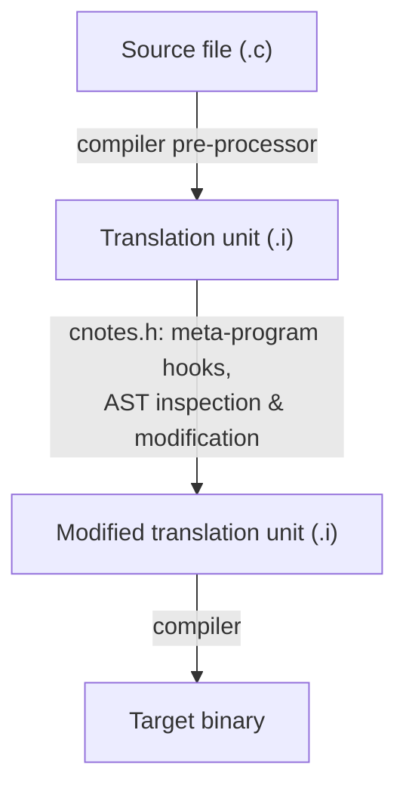

# cnotes.h — Single Header C Meta Programming Library

**A header-only library for building C meta programs, static analysis tools, and source transformation pipelines — operating directly on pre-processed `.i` files.**


> [!WARNING]
> **Initial development.** This library does not yet implement its full scope, and APIs may change without notice. Not recommended for production use or for your serious projects.

---

## :pushpin: Overview

`cnotes.h` is a self-contained, single-header C library that parses pre-processed C translation units (`.i` files), builds a typed Abstract Syntax Tree, resolves symbols and bindings, and evaluates constant expressions — all within a single `#include`. It is designed for authors who need code generation and introspection capabilities without too much complexity and overhead. Aiming to give practical tools for various meta programming techniques that utilize transformation and introspection of C source at compile time.

The library is influenced by the design philosophy of [`stb`](https://github.com/nothings/stb) and [`nob`](https://github.com/tsoding/nob.h): easy integration with no dependencies, no giant build systems, just one file.

The library core meta programming ideas are also heavily inspired by Jai Programming Language.

> [!IMPORTANT]
> **Above all**, `cnotes.h` is a personal learning project. I built it to explore how language parsing, source transformation and meta programming work under the hood. It's shared openly in case others find it useful or interesting, but it isn't meant to be a product or a replacement for established tools.

---

## :dart: Goal

`cnotes.h` aims to integrate with major C compilers — GCC, Clang, and MSVC —
understanding each compiler's syntax and extensions, while staying compatible
with the C99 standard.

### :clipboard: Current Status

**Compiler support:** GCC (partial) · Clang (not started) · MSVC (not started)

GCC support currently covers core C99+ and some GNU extensions. Clang and
MSVC are not yet started. Each compiler's extensions and language features
add complexity, so support is being added incrementally rather than all at once.

Following is the list of features that are still not implemented, but will be in the future.

> [!NOTE]
> This list might NOT include every feature that was not implemented, and can be added to as they are discovered or suggested.

 -  **VLA, variable length arrays support.**
 -  **Struct and Union empty member declarations.**
 -  **Tag type same name proper shadowing.**
 -  **ASM definitions.**
 -  **K&R-style function definitions.**
 -  **_Atomic specifiers.**
 -  **_Complex types.**
 -  **Char literals.**
 -  **HEX float literals.**
 -  **Binary integer literals.**
 -  **Label + goto correctness checking.**
 -  **FAM, Flexible Array Member.**
 -  **MSVC Specific compiler extensions.**
 -  **Full Type Table serialization into .i file for Cn_Type introspection.**
 -  **CFG, Control-Flow Graph construction and analysis interface for the advanced meta-programming.**

---

## :bulb: Quick Start

The only file needed in your project from this repository is [cnotes.h](https://github.com/dmarshaq/cnotes.h/blob/main/cnotes.h). The rest of the files you create by yourself and customize how everything runs in your own build system.

`cnotes.h` is built around a fixed processing pipeline that enables
AST-level introspection and code modification:



:mag_right: **Examples:** If you want to jump straight into playable code — see [how_to](https://github.com/dmarshaq/cnotes.h/tree/main/how_to)

### :hammer_and_wrench: Manual Setup

Below is the manual workflow of how meta-program is built and ran on the source file.

#### 1. Obtain the header
Copy `cnotes.h` into your project. No other files are required.

#### 2. Pre-process your source file
`cnotes.h` operates on **pre-processed** `.i` files — macros must already be
expanded for the library to parse C files correctly. Use your compiler's
pre-processor:

```sh
# GCC
# Pre-processing my_main.c
gcc -E -o my_main.i my_main.c
```

#### 3. Write your meta program
In **exactly one** translation unit, define `CN_IMPLEMENTATION` before the
include. Every other file that uses the API includes the header normally.

This means two `.c` files: one meta-program file that defines and uses
`cnotes.h`, and the main file the meta program will process.

```c
// `meta.c` is the one file that holds implementation of `cnotes.h`
// sets everything up and performs operations on the `my_main.i` file.
#define CN_IMPLEMENTATION
#include "cnotes.h"

int main(void) {
    // Initialization, passing input file.
    Cn_Translation_Unit tu = {0};
    if (!cn_tu_init(&tu, "my_main.i")) return 1;

    // Processing translation unit.
    if (cn_tu_process(&tu) != 0) {
        fprintf(stderr, "Processing failed with %ld error(s)\n", tu.data.error_count);
        cn_tu_free(&tu);
        return 1;
    }

    // Freeing everything.
    cn_tu_free(&tu);
    return 0;
}
```

#### 4. Build and run

```sh
# GCC
# Compiling meta program
gcc -Wextra -Wall -std=c99 -o meta meta.c

# Running meta program
./meta

# Compiling meta-processed my_main.i
gcc -Wextra -Wall -std=c99 -o my_main my_main.i

# Running program
./my_main
```

---

:seedling: Suggestions are welcome! The project is still in early development, so I'm keeping a close eye on its direction. Not every change may be merged, but every idea is appreciated.
